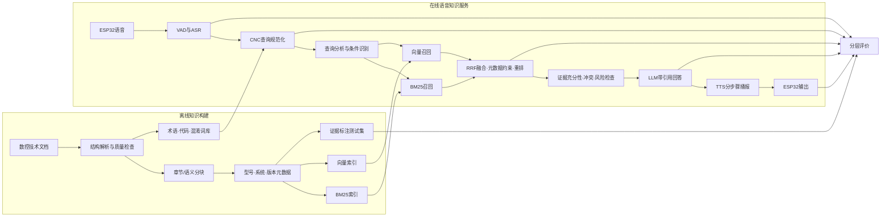
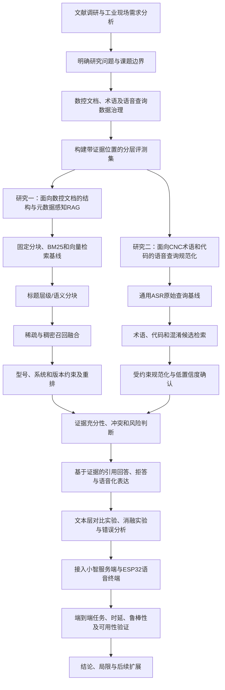

# 面向数控加工现场的语音交互式RAG知识服务：完整技术路线（审阅稿）

更新日期：2026年8月11日

## 一、路线结论

本课题建议采用“两条数据链、四层实验、一个硬件验证平台”的总体路线：

- 离线知识链：数控文档采集 → 结构解析 → 分块与元数据 → 稀疏/向量索引 → 评测集；
- 在线交互链：ESP32语音 → ASR → CNC查询规范化 → 混合检索与重排 → 证据检查 → LLM回答 → TTS；
- 四层实验：数据与索引、语音查询、检索生成、端到端系统；
- 一个验证平台：ESP32仅承担语音采集与播放，算法在服务端运行。

论文采用“一个主要方法、一个应用改进、一个验证系统”的工作量结构：

1. **主要方法**：利用文档结构和设备元数据约束的混合检索与证据生成；
2. **应用改进**：CNC术语、代码及参数的语音查询规范化；
3. **验证系统**：小智服务端与ESP32语音终端。

硬件平台用于证明方法能够在工业语音场景中完整落地，不把接入ESP32、ASR或TTS本身作为算法创新。

本文列出的BM25、向量检索、RRF、元数据约束和Cross-Encoder是当前可解释基线与候选实现，不是不可替换的最终技术栈。后续允许采用效果更好的新方法，但必须在同一数据、指标和资源记录下与基线公平比较，并通过消融说明增益来源。

### 1.1 系统数据流图

下图回答“系统中的数据怎样流动、各模块怎样连接”。



### 1.2 论文研究技术路线图

下图回答“论文先研究什么、如何形成方法、怎样通过实验验证”。它与系统架构图不是同一张图，可直接用于开题报告或向导师说明研究过程。



全文复核后的实施判断是：先完成文本RAG基线与结构化检索，再完成ASR后查询规范化，最后接入硬件。朱鹏丞论文的Whisper微调建立在约16小时清洗标注语音及400条语音测试样本上；在尚无同等规模CNC语音数据时，不把ASR微调列为必做项，避免语音模块挤占RAG方法和实验的工作量。

## 二、已有研究怎么做，以及本课题如何取舍

### 2.1 最接近的硕士论文

| 对标研究 | 已有技术路线 | 本课题借鉴内容 | 不照搬内容 |
|---|---|---|---|
| 朱鹏丞，中国矿业大学，2025，《基于自然语言处理的煤矿调度语音智能处理与交互研究》 | 领域语料与术语库 → VAD/Whisper微调/热词解码 → N-best与RAG纠错 → 语义分析 → 煤矿RAG决策支持系统 → 对比及消融 | 工业噪声、专业术语、ASR误差向RAG传播、语音纠错和系统分层实验 | 前期不微调Whisper，不把完整ASR算法创新作为硬性任务 |
| 吴涵谦，北京邮电大学，2025，《面向私域的大语言模型个性化问答优化研究》 | 多维训练数据 → 领域嵌入 → 多维向量库 → 问题重写 → 上下文聚类精简 → 模块化问答系统 | 私域数据构建、查询处理、上下文精简、系统模块解耦 | 前期不训练专用Embedding；先验证分块、混合检索及元数据是否足够 |
| 张书睿，北京邮电大学，2025，《基于树状层次语义的动态检索增强生成技术研究》 | 文档结构识别 → 树状层次索引 → 语义/递归分块 → 动态检索与中止 → 公共数据集对比消融 | 保留数控手册标题层级、父子块关系及章节上下文 | 不直接引入复杂树遍历、GMM和UMAP，除非普通结构化索引实验显示明显不足 |
| 孙文利，北京邮电大学，2025，《基于大语言模型的智慧工厂管理系统设计实现与优化研究》 | 工厂数据层 → 自然语言查询 → 多向量融合 → 报告生成 → 真实工厂任务评估 | “工业数据—算法—系统—任务评价”的论文结构，交互准确率与响应速度指标 | 不把工厂管理SQL查询、IoT控制和报表功能纳入本课题 |

上述论文说明，本课题的“工业专业语音 + RAG + 系统验证”结构具有硕士论文先例。其中最直接的章节模板是朱鹏丞论文，但本课题应将其“煤矿语音处理”替换为“数控语音查询规范化”，将“煤矿决策支持”替换为“数控技术知识服务”。

### 2.2 可直接支撑各模块的研究

1. 电力领域Meta-RAG采用“文档转换、元信息抽取与增强、文档解析、混合检索”的流程，说明专业规范文档可以通过元数据驱动检索，不必依赖知识图谱。
2. 罕见病领域混合RAG将关键词稀疏检索与稠密向量检索结合，并用RRF融合，验证了垂直领域混合检索优于单路检索的常见设计。
3. 国防科技大学相关研究比较段落分块和固定长度分块，并研究混合检索后的重排序及上下文位置，说明分块和证据编排都应进入消融实验。
4. EMNLP 2025关于ASR上下文发现的研究使用检索自动寻找稀有词上下文，并与LLM上下文生成、识别后纠错比较，报告了无上下文基线上的相对WER下降，说明“领域词检索辅助ASR/纠错”有研究依据。
5. ACL 2025的DARAG使用可检索领域实体辅助ASR生成式纠错，并在域内和域外设置中报告相对WER改进，说明领域术语库可以作为独立、可更新的纠错知识源。
6. RAGAS和ARES将RAG评测拆为上下文相关性、答案忠实性和答案相关性，说明不能只用一个综合分数评价系统。

## 三、总体系统架构

```text
┌──────────────────────── 离线知识构建 ────────────────────────┐
│ 原始数控文档                                                  │
│   → 文件登记与版本治理                                        │
│   → PDF/OCR/表格/标题层级解析                                  │
│   → 章节感知与语义分块                                        │
│   → 型号、系统、版本、页码、类别等元数据                       │
│   → BM25索引 + 向量索引 + CNC术语/代码库                       │
│   → 带标准答案和证据位置的测试集                               │
└───────────────────────────────────────────────────────────────┘
                              ↓
┌──────────────────────── 在线语音问答 ────────────────────────┐
│ ESP32/麦克风 → VAD → ASR及候选文本                            │
│   → CNC术语、代码与参数查询规范化                              │
│   → 查询类型及型号/版本约束识别                                │
│   → BM25召回 ∥ 向量召回                                       │
│   → RRF融合 → 元数据约束 → Cross-Encoder重排                  │
│   → 证据充分性/冲突/风险检查                                   │
│   → LLM基于证据生成 → 引用与安全提示                           │
│   → 面向语音的短句/分步骤改写 → TTS → ESP32播放                │
└───────────────────────────────────────────────────────────────┘
```

系统分为三个服务边界：

1. **语音网关**：负责ESP32连接、Opus音频、VAD、ASR和TTS；
2. **CNC-RAG服务**：负责查询规范化、检索、重排、证据判断和回答生成；
3. **实验评测模块**：离线读取固定数据集，运行基线、消融和结果统计。

语音网关与RAG服务通过OpenAI兼容接口连接，使语音通信链和论文算法能够独立替换、单独测试。

## 四、离线知识构建路线

### 4.1 文档选择与版本治理

优先选择同一数控系统或同一系列设备的资料，首批覆盖操作、编程、参数、报警、维护和安全中的两至三类。每份文档登记：

- 文档ID、名称、来源和文件哈希；
- 厂商、设备型号和数控系统；
- 软件/文档版本及发布日期；
- 知识类别、语言和许可情况；
- 是否进入知识库及是否进入最终评测集。

明确型号或版本的查询采用硬过滤；仅从上下文推断出的型号或版本采用软加权。如果缺少必要条件，系统先澄清，不在不同型号文档之间直接拼接答案。

### 4.2 解析和结构恢复

处理流程为：

```text
PDF分类
  → 可复制PDF直接解析 / 扫描PDF执行OCR
  → 去除页眉页脚及重复内容
  → 恢复标题层级、段落、页码、表格和代码条目
  → 保存统一中间格式
  → 抽样人工核验
```

表格、报警代码和参数表不能简单按字符长度打散。代码/参数名称、含义、适用条件和说明应尽量保存在同一知识单元中。

### 4.3 分块与索引

至少实现三种分块方法，用于后续比较：

1. 固定长度分块：作为最简单基线；
2. 标题层级分块：保留章节路径和页码；
3. 标题层级 + 语义边界分块：作为候选完整方法。

每个叶子块保存父级章节摘要或章节路径。索引分为：

- BM25：适合精确匹配G/M代码、报警号、参数名和专有词；
- 向量索引：适合口语化、同义表达和描述性查询；
- 元数据索引：适合设备、系统、版本和知识类别约束。

### 4.4 测试集构建

问题类型建议包括：

- 术语及代码解释；
- 操作或维护步骤；
- 带型号/版本条件的查询；
- 报警含义及辅助排查；
- 跨段或跨章节查询；
- 表格参数查询；
- 信息不足的歧义问题；
- 文档中不存在答案的问题；
- 可能涉及高风险操作的问题。

每道问题至少标注：标准答案、证据块、文档和页码、问题类型、型号/版本条件、能否回答、安全等级。

建议规模分两步：先用3～5份文档和约100题完成流程；正式实验再根据文档可得性扩展到约300～500题，并抽取一部分进行双人复核。最终规模由导师和数据条件确认，不为了数量自动生成大量低质量问题。

## 五、在线查询与回答路线

### 5.1 语音采集和ASR

第一阶段采用按键说话：ESP32采集音频并通过WebSocket/Opus发送到服务端，VAD判断语音片段，ASR输出1-best文本；如果ASR接口支持，再保留N-best候选及置信度。

不在第一阶段训练ASR模型。先选择一个稳定基线，验证领域查询规范化能否改善下游效果。只有当通用ASR成为主要性能瓶颈且具备足够领域语音数据时，才把热词解码或轻量微调作为扩展实验。

### 5.2 CNC语音查询规范化

该模块不是自由改写文本，而是受约束的候选校正：

```text
ASR原始文本/N-best
  → 检测疑似术语、字母数字和代码位置
  → 从CNC词表、代码表、历史混淆对检索候选
  → 结合字形、拼音/读音、上下文和检索证据评分
  → 输出规范化查询、修改位置、候选及置信度
  → 低置信度关键代码要求用户确认
```

必须保留原文和修改轨迹，并允许“不修改”。这可以减少LLM过度纠错造成的新错误。

### 5.3 查询分析

从规范化查询中识别：

- 查询意图：解释、步骤、查参数、查报警、辅助排查或追问；
- 精确标识：G/M代码、参数号、报警号、部件名；
- 约束条件：设备型号、数控系统、版本和知识类别；
- 对话状态：“下一步、重复、停止、查看来源”。

缺少会改变答案的型号或版本时，先进行澄清；不影响答案时继续检索。

### 5.4 混合检索与重排

推荐流程：

1. 原查询与规范化查询分别生成检索表达；
2. BM25召回精确术语和代码片段；
3. 向量检索召回语义相近片段；
4. 使用RRF融合两路结果，减少不同得分尺度带来的调参依赖；
5. 根据显式型号/版本进行硬过滤，根据推断条件进行软加权；
6. 使用Cross-Encoder重排Top-N候选；
7. 去除重复证据并补充必要父章节上下文；
8. 将最终少量证据送入生成模型。

“查询重写、多查询扩展、上下文压缩”作为候选增强模块，只有基线错误分析证明其必要时再加入，避免初期链路过长而无法定位增益来源。

### 5.5 证据判断与回答生成

生成前进行三类判断：

1. 充分性：证据是否足以回答问题；
2. 一致性：不同文档、型号或版本是否冲突；
3. 风险性：是否涉及参数修改、解除互锁、运动控制等高风险内容。

回答采用结构化格式：

```text
直接结论
必要条件/适用型号
分步骤说明（如适用）
证据来源：文档、章节、页码
安全提示（如适用）
```

证据不足时明确拒答并说明缺少什么；版本冲突时分别列出适用条件；不得利用模型常识补写文档中不存在的操作参数。

### 5.6 面向语音的输出

屏幕保留完整答案和出处，TTS只播报适合听取的摘要。较长操作流程按步骤输出，支持“下一步、重复、停止、来源是什么”。这样避免一次播报大量内容，也便于任务完成率实验。

## 六、实验路线与论文对应

### 6.1 主方法实验A：文档结构与索引

研究问题：数控手册的章节结构和元数据是否能改善检索？

对比：

- 固定长度分块；
- 标题层级分块；
- 标题层级 + 语义分块；
- 完整方法去掉元数据约束；
- 完整方法去掉父级上下文。

指标：解析抽检准确率、Recall@k、MRR、nDCG@k，按代码类、步骤类、版本类问题分组报告。

### 6.2 主方法实验B：混合检索与重排

研究问题：不同召回、融合和重排模块分别贡献多少？

对比：

- BM25；
- 向量检索；
- BM25 + 向量加权融合；
- BM25 + 向量RRF；
- RRF + 元数据约束；
- RRF + 元数据约束 + Cross-Encoder重排。

除整体指标外，报告精确代码查询与自然语言描述查询的差异，并记录检索延迟。

以上6.1和6.2共同构成一个检索主方法的基线、完整方法与消融实验，不作为两个彼此独立的研究方向。正式论文可合并在同一方法章中，主对比控制在约5组，关键消融控制在约3项。

### 6.3 应用改进实验：语音查询规范化

研究问题：纠错是否真正改善识别及下游RAG，而不是只让句子更通顺？

对比：

- ASR原始结果；
- 通用LLM直接纠错；
- 领域词表候选纠错；
- 领域检索辅助的受约束纠错；
- 完整方法去掉置信度确认。

指标：CER/WER、术语准确率、代码完全匹配率、过度纠错率，以及纠错前后的Recall@k和最终回答正确率。噪声条件至少包括安静环境和一种可重复播放的现场噪声；更多信噪比档位视数据量决定。

### 6.4 补充实验：回答质量与拒答

对比：

- LLM直接回答；
- 仅向量RAG；
- 完整RAG；
- 完整RAG去掉证据充分性判断；
- 完整RAG去掉版本/冲突约束。

指标：答案正确性、忠实性、完整性、引用准确率、拒答准确率、安全规则触发准确率。自动评价可以参考RAGAS/ARES维度，但最终结果应结合人工或领域人员抽样复核，不能只报告LLM-as-a-Judge分数。

### 6.5 系统验证：端到端硬件系统

任务包括代码解释、步骤查询、报警查询、版本限定查询、无答案问题和分步骤追问。测量：

- ASR结束至首次文本/语音响应时间；
- 完整回答时间；
- 端到端任务完成率；
- 语音中断、重复和下一步成功率；
- 用户对准确性、易用性和信任度的评价；
- 失败归因：音频、ASR、规范化、检索、生成或TTS。

## 七、实验数据流与可复现要求

每次请求分配唯一ID，并保存：

```text
音频文件（如为语音实验）
ASR原始文本和候选
规范化文本及修改轨迹
两路召回结果和原始分数
融合及重排结果
最终证据块
提示模板版本
模型输出和引用
各阶段耗时
人工/自动评价结果
```

每次批量实验固定数据集版本、索引版本、模型、参数、随机种子和代码版本。调试集和最终测试集隔离；最终测试集不得用于反复选择提示词和阈值。

## 八、代码实现边界

建议的CNC-RAG模块：

```text
services/cnc-rag/
├─ ingestion/       # PDF解析、结构恢复和分块
├─ metadata/        # 型号、版本和类别字段
├─ terminology/     # 术语、代码和混淆对
├─ indexing/        # BM25与向量索引
├─ normalization/   # ASR查询规范化
├─ retrieval/       # 多路召回
├─ fusion/          # RRF/加权融合
├─ reranking/       # Cross-Encoder重排
├─ grounding/       # 充分性、冲突、拒答和安全判断
├─ generation/      # 提示、引用和语音答案改写
├─ api/             # OpenAI兼容接口和调试接口
└─ evaluation/      # 基线、消融、指标和报告
```

建议接口：

- `POST /v1/chat/completions`：供语音网关调用；
- `POST /debug/retrieve`：返回每路召回及重排过程，仅实验使用；
- `POST /debug/normalize`：返回纠错候选与修改轨迹；
- `GET /health`：服务健康检查。

## 九、实施顺序与阶段出口

### 阶段A：数据闭环

完成3～5份文档、统一中间格式、约100个有证据问题。出口条件：任一测试问题都能追溯到原文页码。

### 阶段B：文本检索基线

完成BM25、向量检索及统一评测脚本。出口条件：能够重复生成检索结果表，并完成按问题类型的错误分析。

### 阶段C：核心RAG方法

完成混合检索、元数据约束、重排、引用和拒答。出口条件：主对比与消融实验结果稳定，明确每个模块的收益和代价。

### 阶段D：语音查询

完成领域语音测试集和受约束查询规范化。出口条件：不仅CER/WER改善，而且下游检索或回答指标获得稳定提升，过度纠错可控。

### 阶段E：硬件平台

完成ESP32音频闭环及端到端任务实验。出口条件：能够稳定演示，日志可将失败定位到具体模块，且不存在机床控制能力。

### 阶段F：论文固化

冻结数据、代码、配置和图表，按“数据—方法—语音系统—综合实验”顺序完成章节。

## 十、风险与降级方案

| 风险 | 判断方式 | 降级或处理 |
|---|---|---|
| 数控文档不足或版本混乱 | 无法建立可靠证据标注 | 缩小到一个数控系统或一套设备资料 |
| PDF表格和代码解析错误多 | 参数/报警问题召回失败 | 重要表格单独结构化，保留原页截图用于核验 |
| 混合检索提升不明显 | 相对单路基线无稳定增益 | 从问题类型、分块和元数据分析，不继续堆模型 |
| LLM纠错出现过度修改 | 代码准确率下降 | 使用候选约束、阈值和“不修改”选项，关键代码复述确认 |
| 缺少足够语音数据 | 无法支撑ASR微调 | 不微调ASR，只做黑盒识别后的领域规范化 |
| ESP32联调耗时过大 | 文本实验被拖延 | 退回电脑麦克风完成语音实验，ESP32只做最终演示闭环 |
| 自动评价可信度不足 | 与人工评价不一致 | 用小规模人工标注校验评价器，并报告一致性 |

## 十一、建议写进论文的研究点

在实验完成前使用“研究点”而非“创新点”：

1. 针对CNC术语、代码及参数易被语音误识别的问题，研究基于领域候选检索和置信度约束的查询规范化方法；
2. 针对数控手册结构复杂、型号和版本敏感的问题，研究融合章节结构、稀疏/稠密检索及元数据约束的证据检索方法；
3. 构建带引用、拒答、安全约束和分步骤语音输出的ESP32验证平台，建立从ASR到RAG回答的分层评价体系。

其中第2项是主要方法贡献，第1项按较小规模形成应用改进，第3项体现系统集成、工程应用和综合验证。当前不强制训练模型；只有当完整检索方法相对强基线缺少稳定增益时，才将领域Embedding或重排模型的轻量微调作为后备增强。

## 十二、审阅时需要决定的问题

1. 论文是否采用“一个主要方法 + 一个应用改进 + 一个硬件验证平台”的结构？
2. 主数据是否限定到某个数控系统或设备系列？
3. 文档结构实验是否只做标题层级和语义分块，不做复杂树状动态检索？
4. ASR是否先作为黑盒，主攻识别后的受约束规范化，不把模型微调作为必做内容？
5. 正式测试集目标是否采用约300～500题，并加入无答案、版本冲突和安全问题？
6. 硬件是否确认采用按键说话，ESP32仅承担音频输入输出？

## 十三、主要对标资料

- [朱鹏丞：基于自然语言处理的煤矿调度语音智能处理与交互研究，中国矿业大学，2025](https://cnki.istiz.org.cn/kcms/detail/detail.aspx?dbcode=CMFD&dbname=CMFD2026&filename=1025823749.nh)
- [吴涵谦：面向私域的大语言模型个性化问答优化研究，北京邮电大学，2025](https://cnki.istiz.org.cn/kcms/detail/detail.aspx?dbcode=CMFD&dbname=CMFD2026&filename=1025076263.nh)
- [张书睿：基于树状层次语义的动态检索增强生成技术研究，北京邮电大学，2025](https://cnki.istiz.org.cn/kcms/detail/detail.aspx?dbcode=CMFD&dbname=CMFD2026&filename=1025073965.nh)
- [孙文利：基于大语言模型的智慧工厂管理系统设计实现与优化研究，北京邮电大学，2025](https://cnki.istiz.org.cn/kcms/detail/detail.aspx?dbcode=CMFD&dbname=CMFD2026&filename=1025075514.nh)
- [Meta-RAG：基于元数据驱动的电力领域检索增强生成框架](https://cnki.istiz.org.cn/kcms/detail/detail.aspx?dbcode=CJFD&dbname=CJFD2026&filename=JSJC202602034)
- [基于混合检索重排序策略的大模型增强方法](https://cnki.istiz.org.cn/kcms/detail/detailall.aspx?dbcode=CJFD&dbname=CJFD2025&filename=mess202504003)
- [Retrieval Augmented Generation based context discovery for ASR, Findings of EMNLP 2025](https://aclanthology.org/2025.findings-emnlp.768/)
- [Failing Forward: Improving Generative Error Correction for ASR with Synthetic Data and Retrieval Augmentation, Findings of ACL 2025](https://aclanthology.org/2025.findings-acl.125/)
- [RAGAS: Automated Evaluation of Retrieval Augmented Generation, EACL 2024](https://aclanthology.org/2024.eacl-demo.16/)
- [ARES: An Automated Evaluation Framework for Retrieval-Augmented Generation Systems, NAACL 2024](https://aclanthology.org/2024.naacl-long.20/)
