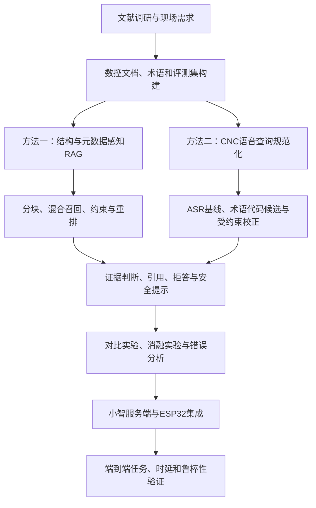

# 硕士学位论文课题方案（导师审阅稿）

更新日期：2026年8月13日

## 一、拟定题目

推荐题目：**面向数控加工现场的语音交互式检索增强知识服务研究**

备选题目：

1. 面向数控加工现场的检索增强生成与语音交互方法研究
2. 面向数控技术知识服务的检索增强生成方法及系统研究

题目采用“数控加工现场”作为机械工程应用背景，以检索增强生成（RAG）为主要研究对象，以语音终端作为工业现场验证方式。知识范围包括操作、编程、参数、报警、维护和安全等内容，不限定为故障诊断。

## 二、研究背景与问题

数控加工现场的技术知识分散在操作手册、编程手册、参数说明、报警手册、维护规程和安全规范中。现场人员查询时可能面临文档数量多、型号与版本混杂、专业代码难以准确输入以及双手被占用等问题。通用大语言模型不能保证掌握企业私有文档和具体设备版本，直接生成还存在答案无依据、内容过时和操作风险等问题。

本课题拟研究面向数控技术文档的RAG知识服务方法，并通过ESP32语音终端验证其在现场免手持输入场景下的可用性。系统只提供知识查询、操作指引和辅助排查，不直接控制机床。

拟解决三个主要问题：

1. ASR容易误识别字母、数字、G/M代码、参数名、报警代码和中英文混合术语，如何将口语查询规范化为适合检索的文本？
2. 技术文档具有明确的型号、系统、版本和章节结构，如何利用关键词、语义及元数据约束提高检索准确率？
3. 如何生成带证据、可拒答、适合语音播报的分步骤答案，并在噪声环境和硬件终端上验证端到端效果？

## 三、总体目标

构建一套“文档知识库—领域检索—大模型回答—语音交互—硬件验证”的数控现场知识服务原型，完成方法对比、模块消融和端到端系统实验。

具体目标如下：

1. 建立包含多类数控技术文档、术语词表和标注问题的实验数据集；
2. 实现CNC专业语音查询规范化方法；
3. 实现BM25与向量检索融合、元数据过滤及重排序方法；
4. 实现带引用、冲突提示、越界拒答和安全约束的回答生成；
5. 基于ESP32、麦克风和扬声器完成语音交互验证，并评价准确性、延迟和任务完成率。

## 四、研究内容

### 4.1 数控技术多源知识库与测试集

- 收集操作、编程、参数、报警、维护和安全类文档；
- 解析PDF正文、标题层级、表格和代码条目；
- 按章节及语义边界分块，保存设备型号、数控系统、文档版本、页码、章节和知识类别等元数据；
- 建立CNC术语、同义表达、字母数字组合、G/M代码、参数名和报警代码词表；
- 构造事实查询、步骤查询、条件查询、跨段查询、歧义查询和无答案查询测试集。

### 4.2 面向CNC术语与代码的语音查询规范化

- 获取ASR原始文本或候选结果；
- 使用领域词表、检索候选和上下文纠正专业术语与代码；
- 保留原始查询、规范化查询和纠正置信度；
- 对低置信度代码进行复述确认，避免错误纠正导致危险回答。

### 4.3 面向技术文档的混合检索与重排序

- 以BM25、向量检索和直接大模型回答作为基线；
- 使用RRF或加权方法融合关键词与向量召回；
- 利用型号、系统、版本、知识类别等元数据过滤或加权；
- 使用Cross-Encoder对候选片段重排序；
- 对证据不足、版本冲突或检索结果矛盾的情况执行拒答或澄清。

### 4.4 带证据的语音回答与交互机制

- 回答中保留文档名称、章节、页码等证据来源；
- 将长答案改写为适合语音输出的短句和分步骤内容；
- 支持“下一步、重复、停止、来源是什么”等有限多轮指令；
- 涉及参数修改、解除互锁或运动控制等内容时提供安全提示和人工确认要求。

### 4.5 ESP32硬件验证平台

- ESP32端负责音频采集、播放、按键和可选屏幕显示；
- 服务端负责VAD、ASR、RAG、LLM和TTS；
- 复用开源项目 `xiaozhi-esp32-server` 的音频通信与语音链路；
- 自行实现独立的数控领域RAG服务，保证核心方法和实验过程可控。

## 五、技术路线

完整模块、对标依据、实验矩阵及降级方案见[《完整技术路线_审阅稿》](完整技术路线_审阅稿.md)。总体路线如下：



其中先完成文本RAG基线与结构化检索，再完成ASR后查询规范化，最后接入硬件验证。新增硕士论文的全文对标与具体取舍见[《新增硕士论文全文对标分析》](新增硕士论文全文对标分析.md)。

```text
数控技术文档
  → 解析、结构恢复、语义分块和元数据标注
  → BM25索引 + 向量索引

ESP32采集语音
  → VAD与ASR
  → CNC术语/代码查询规范化
  → BM25与向量混合召回
  → 型号/版本等元数据约束
  → Cross-Encoder重排序
  → LLM基于证据生成、引用与拒答
  → TTS播报并由ESP32输出
```

本课题不构建知识图谱。知识组织采用文档层次结构、结构化元数据、领域词表、稀疏索引和向量索引完成。

## 六、拟开展的实验

| 实验层次 | 对比或变量 | 主要指标 |
|---|---|---|
| ASR与查询规范化 | 原始ASR、词表纠正、领域检索辅助纠正 | CER/WER、代码准确率、术语准确率 |
| 检索基线 | BM25、向量检索、混合检索 | Recall@k、MRR、nDCG@k |
| 检索消融 | 去掉元数据、去掉重排序、不同分块、不同融合策略 | Recall@k、MRR、nDCG@k |
| 生成质量 | 无RAG、单路RAG、完整方法 | 正确性、忠实性、引用准确率、拒答准确率 |
| 噪声实验 | 安静及若干信噪比/现场噪声条件 | ASR准确率、端到端任务成功率 |
| 系统实验 | 文本输入与语音终端、不同链路配置 | 首响应时间、总响应时间、任务完成率、主观评分 |

实验设计遵循“先建立可重复文本基线，再增加语音变量，最后接入硬件”的顺序，避免把检索误差、生成误差和语音误差混在一起。

## 七、预期研究点及工作量层次

以下表述暂作为研究点，最终需根据实验效果再确定是否能称为创新点：

1. 面向CNC术语、G/M代码、参数和报警代码的语音查询规范化方法；
2. 融合关键词、语义及型号/版本约束的数控技术文档检索与重排序方法；
3. 面向工业现场的可中断、分步骤、带证据和安全约束的语音知识交互机制。

三项工作不采用相同研究强度：第2项为主要方法，第1项为较轻量的应用改进，第3项为系统验证。BM25、通用向量、固定混合检索和重排序用于构成第2项的基线与消融，不分别作为独立创新。当前不强制训练Embedding、LLM或ASR模型；只有主方法相对强基线缺少稳定增益时，才考虑轻量检索模型微调。

ASR、TTS和ESP32接入本身作为系统验证手段，不单独宣称算法创新。

## 八、可行性与工作边界

### 可行性

- RAG为主要技术方向，与现有能力基础一致；
- 数控手册具有较强的术语、代码和版本特征，适合形成明确的问题与实验变量；
- 已找到工业语音交互硕士论文作为结构参考；
- 已抽取开源语音服务器作为通信和语音链路底座，可减少重复开发；
- 硬件只承担输入输出和系统落地验证，不在ESP32上运行大模型。

### 工作边界

- 不构建知识图谱；
- 不研究振动、电流等传感器信号诊断算法；
- 不训练通用大语言模型；
- 原则上不自研完整ASR/TTS模型，仅研究领域查询纠错及其对下游检索的影响；
- 不向真实机床发送控制命令；
- 第一阶段采用按键说话，不将唤醒词、声纹、视觉、数字人和通用IoT纳入论文主体。

## 九、论文章节建议

1. 绪论
2. 相关理论与总体方案
3. 数控技术多源知识库与测试集构建
4. 面向数控技术文档的检索增强问答方法
5. 工业场景语音交互与硬件验证平台
6. 系统实验与结果分析
7. 总结与展望

## 十、预期成果

1. 数控技术文档知识库及带标准答案、证据位置的测试集；
2. CNC语音查询规范化模块；
3. 可重复评测的混合RAG服务及实验代码；
4. ESP32语音交互验证原型；
5. 检索、生成、语音和端到端实验结果；
6. 硕士学位论文及必要的演示材料。

## 十一、请导师重点审阅确认

1. 题目使用“数控加工现场”是否合适，还是需要缩小到某一类设备、数控系统或企业场景？
2. 知识范围是否接受“操作、编程、参数、报警、维护、安全”的宽口径，还是优先限定其中两至三类？
3. 是否认可“不构建知识图谱，RAG为方法主体，ESP32为验证平台”的总体边界？
4. 第4章以混合检索、元数据约束和重排序为主要方法，第5章以语音查询规范化与硬件验证为应用扩展，这一工作量和章节比重是否合适？
5. 学院对实验数据规模、企业数据、硬件实物或论文创新点是否有额外要求？
